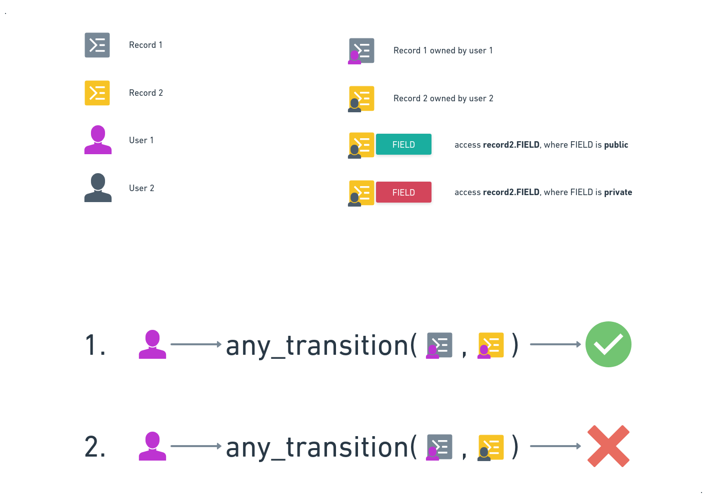
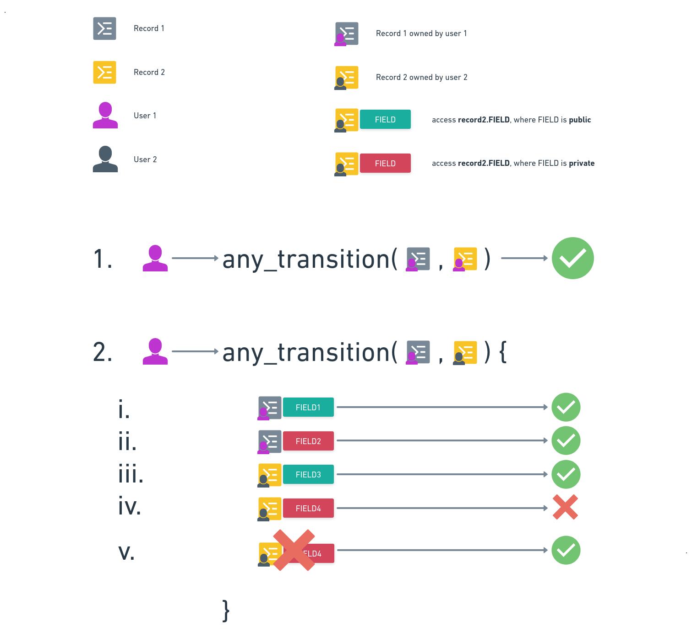
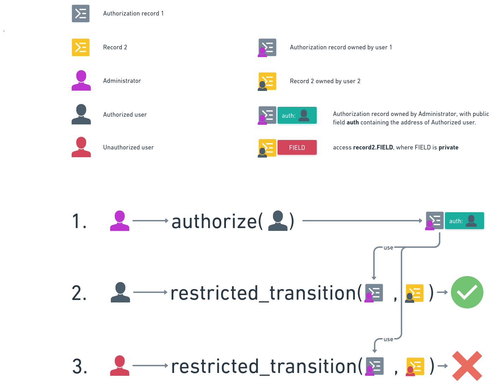

## Abstract

Aleo has a huge leverage over other projects by applying ZK proofs on L1 level. Applying ZK proofs enables great scalability as contracts are run by one and verified by many in O(1) time, as opposed to other protocols where many has to execute code again to verify. There is a caveat though, whatever is executed in the `finalize` function uses one executes and many executes again model which means it is as scalable as legacy protocols. The record infrastructure of Aleo makes it scalable, but some minor (?) change is needed in snarkVM: allow the access of any public fields of records with any `owner` within a transition. With other words: we need "create by one and read by many" types of records usable in transitions. 

It has several applications, including but not limited to:
1. Authorization: 
    1. a record issued by an issuer can be used as a proof of authorization for a transition. Owner is the issuer, and the public field of the authorized address can be used by that address to access the transition.
    2. Components of a complex system can be authorized using the record with owner of admin, and with field `authorized` with the address of the authorized component. 
2. Enable or disable system transitions. The existance of a record can prove that a transition is enabled or disabled. The record can be issued by the admin.
3. Provide token prices for the system. A records public field can be the price provided by some oracle for a token. The record can be updated by the oracles and read by anyone.
4. Provide UTC time for the system: A record of the current UTC time can be consumed and recreated by a node every 1 minutes and read by anyone.

## Specification

**Figure 1: Current Transition Logic**

In **Figure 1** user 1 is the signer of the transition.

As **Figure 1** shows, the current transition logic is the following:
1. If the transition has only the type of records that are owned by the caller, then the transition is executed.
2. If any of the input records are not owned by the caller, then the transition is not executed. Even if the record has public fields that otherwise should be accessible.

**Figure 2: Proposed Transition Logic**

In **Figure 2** user 1 is the signer of the transition.

As **Figure 2** shows, the proposed transition logic is the following:
1. If the transition has only the type of records that are owned by the caller, then the transition is executed. Just like in the current logic.
2. If the input of the transition is a mix of records owned by the caller and not owned by the caller, then:
    1. All the public fields of the records owned by the caller are accessible in the transition. Just like in the current logic.
    2. All the private fields of the records owned by the caller are accessible in the transition. Just like in the current logic.
    3. All the public fields of the record not owned by signer are accessible in the transition. **DIFFERENT from the current logic!**
    4. Accessing any private fields of the record not owned by signer will result in an error. **DIFFERENT from the current logic!**
    5. Not accessing any fields of a record that is not owned by signer should be allowed. **DIFFERENT from the current logic!** 
    This is needed for allowing the execution of certain transitions. The very existence of the record is the proof of the transition being enabled. The transition must fail if the record is not present.

### Use Cases

#### Authorization Record

<!-- Define key terminology here. -->

<!-- Describe the architecture. -->

<!-- Include process diagrams. -->

### Test Cases

This section should introduce any and all critical test cases that need to be considered for the specification.

<!-- Provide any test vectors that should be included in unit and/or integration tests. -->

<!-- Are there edge cases to be aware of? -->

<!-- Include test code snippets, if possible. ->

## Reference Implementations

This section should contain links to reference implementations that the community can review to evaluate the
quality, complexity, and completeness of the new ARC standard.

<!-- Link to any relevant Github issues. -->

<!-- Link to any related Github branches and/or pull requests. -->

## Dependencies

This section should list the affected products, projects, and repositories that either directly or indirectly
are affected by this ARC proposal.

<!-- Will this affect the Aleo PM, Aleo Explorer, or Aleo Studio? -->

<!-- Will this affect Aleo, Leo, snarkOS, snarkVM, or any other repositories? -->

### Backwards Compatibility

This section should cover any and all backwards incompatibility risks, along with their severity.

<!-- List all backwards incompatibilities and their severity. -->

<!-- How will the backwards incompatibilities be resolved? -->

## Security & Compliance

This section should address any security and regulatory concerns if the ARC proposal were incorporated into Aleo.
If you are uncertain, please don't hesitate to ask the core team on Discord.

<!-- Outline any potential security concerns. -->

<!-- Does this proposal introduce regulatory risk? -->

## References

This section should provide any materials that would help reviewers have better context on the nature of the ARC proposal.

<!-- List any links that would be helpful for context. -->

